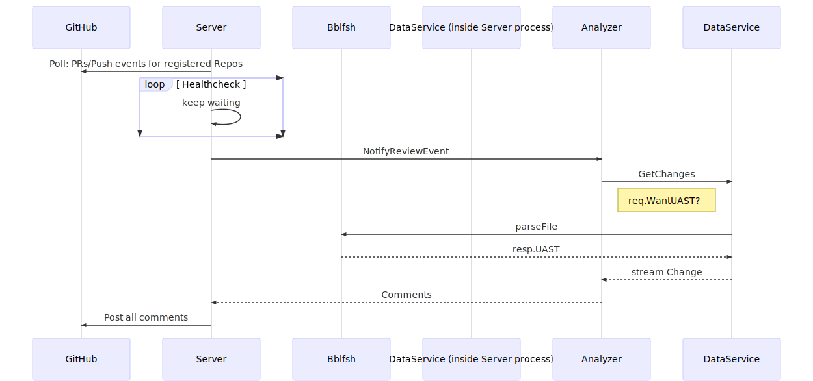

# lookout

[lookout DesignDoc](https://docs.google.com/document/d/1pqz-_SHO5BsJE-aa8o_bAY3r5vR67amnWN8-qZc2UgY/edit#)

## Components

Lookout consists of next components
 * **Server**
   Main component, runing in a separate process.
   Responsible for orchestrating all other services in response to review requests by external code review system and posting the results back.

* **DataService**
  Git data access service, responsible for fetching and storing git repositories.

* **Analyzer**
  Component that does all smart code analysis. 
  [github.com/src-d/style-analyzer](https://github.com/src-d/style-analyzer)

* **SDK** for Analyzers
  - .proto with gRPC interface definition for all services above
  - `lookout` binary, for curl-like experience of testing 
  
  [github.com/src-d/lookout/sdk](https://github.com/src-d/lookout/tree/master/sdk)

## Sequence diagram

To generate an image, use [https://mermaidjs.github.io/ editor](https://mermaidjs.github.io/mermaid-live-editor/#/edit/eyJjb2RlIjoic2VxdWVuY2VEaWFncmFtXG4gICAgcGFydGljaXBhbnQgR2l0SHViXG4gICAgcGFydGljaXBhbnQgU2VydmVyXG4gICAgcGFydGljaXBhbnQgQmJsZnNoXG4gICAgcGFydGljaXBhbnQgRGF0YVNlcnZpY2UgKGluIFNlcnZlcilcbiAgICBwYXJ0aWNpcGFudCBBbmFseXplclxuICAgIFNlcnZlci0-PkdpdEh1YjogUG9sbDogUFJzL1B1c2ggZXZlbnRzIGZvciByZWdpc3RlcmVkIFJlcG9zXG4gICAgbG9vcCBIZWFsdGhjaGVja1xuICAgICAgICBTZXJ2ZXItPlNlcnZlcjoga2VlcCB3YWl0aW5nXG4gICAgZW5kXG4gICAgU2VydmVyLT4-QW5hbHl6ZXI6IE5vdGlmeVJldmlld0V2ZW50XG4gICAgQW5hbHl6ZXItPj5EYXRhU2VydmljZTogR2V0Q2hhbmdlc1xuICAgIE5vdGUgbGVmdCBvZiBEYXRhU2VydmljZTogcmVxLldhbnRVQVNUP1xuICAgIERhdGFTZXJ2aWNlLT4-QmJsZnNoOiBwYXJzZUZpbGVcbiAgICBCYmxmc2ggLS0-PiBEYXRhU2VydmljZTogcmVzcC5VQVNUXG4gICAgRGF0YVNlcnZpY2UtLT4-QW5hbHl6ZXI6IHN0cmVhbSBDaGFuZ2VcbiAgICBBbmFseXplci0tPj5TZXJ2ZXI6IENvbW1lbnRzXG4gICAgU2VydmVyLT4-R2l0SHViOiBQb3N0IGFsbCBjb21tZW50c1xuIiwibWVybWFpZCI6eyJ0aGVtZSI6ImRlZmF1bHQifX0)

```
sequenceDiagram
    participant GitHub
    participant Server
    participant Bblfsh
    participant DataService (inside Server process)
    participant Analyzer
    Server->>GitHub: Poll: new PRs/Pushes for registered Repos?
    loop Healthcheck
        Server->Server: keep waiting
    end
    Server->>Analyzer: NotifyReviewEvent
    Analyzer->>DataService: GetChanges
    Note left of DataService: req.WantUAST?
    DataService->>Bblfsh: parseFile
    Bblfsh -->> DataService: resp.UAST
    DataService-->>Analyzer: stream Change
    Analyzer-->>Server: Comments
    Server->>GitHub: Post all comments
```


