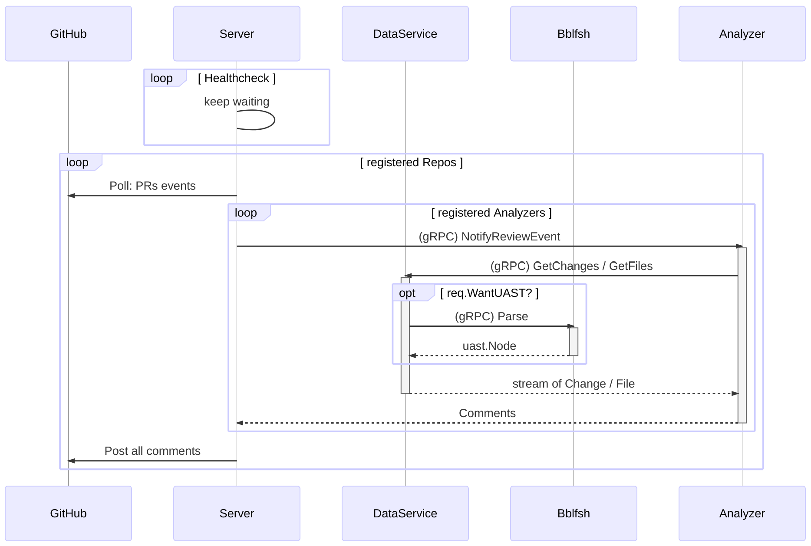

# source{d} Lookout Architecture

You can [edit this image](https://mermaidjs.github.io/mermaid-live-editor/#/edit/eyJjb2RlIjoic2VxdWVuY2VEaWFncmFtXG4gICAgcGFydGljaXBhbnQgR2l0SHViXG4gICAgcGFydGljaXBhbnQgU2VydmVyXG4gICAgcGFydGljaXBhbnQgRGF0YVNlcnZpY2VcbiAgICBwYXJ0aWNpcGFudCBCYmxmc2hcbiAgICBwYXJ0aWNpcGFudCBBbmFseXplclxuICAgIGxvb3AgcmVnaXN0ZXJlZCBSZXBvc1xuICAgICAgICBTZXJ2ZXIgLT4-IEdpdEh1YjogcG9sbGluZyBQUnMvUHVzaCBldmVudHNcbiAgICAgICAgbG9vcCByZWdpc3RlcmVkIEFuYWx5emVyc1xuICAgICAgICAgICAgU2VydmVyIC0-PiArQW5hbHl6ZXI6IChnUlBDKSBOb3RpZnlSZXZpZXdFdmVudCAvIE5vdGlmeVB1c2hFdmVudFxuICAgICAgICAgICAgQW5hbHl6ZXIgLT4-ICtEYXRhU2VydmljZTogKGdSUEMpIEdldENoYW5nZXMgLyBHZXRGaWxlc1xuICAgICAgICAgICAgb3B0IHJlcS5XYW50VUFTVD9cbiAgICAgICAgICAgICAgICBEYXRhU2VydmljZSAtPj4gK0JibGZzaDogKGdSUEMpIFBhcnNlXG4gICAgICAgICAgICAgICAgQmJsZnNoIC0tPj4gLURhdGFTZXJ2aWNlOiB1YXN0Lk5vZGVcbiAgICAgICAgICAgIGVuZFxuICAgICAgICAgICAgRGF0YVNlcnZpY2UgLS0-PiAtQW5hbHl6ZXI6IHN0cmVhbSBvZiBDaGFuZ2UgLyBGaWxlXG4gICAgICAgICAgICBBbmFseXplciAtLT4-IC1TZXJ2ZXI6IENvbW1lbnRzXG4gICAgICAgIGVuZFxuICAgIFNlcnZlciAtPj4gR2l0SHViOiBQb3N0IGFsbCBjb21tZW50c1xuICAgIGVuZCIsIm1lcm1haWQiOnsidGhlbWUiOiJkZWZhdWx0In19) using [mermaid](https://mermaidjs.github.io). ([sourcecode](assets/lookout-seq-diagram.md))

Lookout consists of the following components:

## Server

It is the main component, running in a separate process.
It is responsible for orchestrating all the other services.
It takes review requests made by an external code review system, calls the registered analyzers to review the changes, and posts the results back.

## Lookout DataService

_For the gRPC **Lookout DataService** service definiton you can take al look to **[`service_data.proto`](https://github.com/src-d/lookout-sdk/blob/master/proto/lookout/sdk/service_data.proto#L27)**_

**Lookout DataService** deals with actual Git repositories; it is responsible for fetching and storing git repositories.

**Lookout DataService** is also exposed by **Lookout** as a gRPC service &mdash;by default, on `localhost:10301`&mdash; that can be called by the analyzers to request a stream (ie. [go](https://grpc.io/docs/tutorials/basic/go.html#server-side-streaming-rpc-1), [python](https://grpc.io/docs/tutorials/basic/python.html#response-streaming-rpc)) of files and changes from **Lookout DataService** that **Lookout** exposes.

The [ChangesRequest](https://github.com/src-d/lookout-sdk/blob/master/proto/lookout/sdk/service_data.proto#L58) or [FilesRequest](https://github.com/src-d/lookout-sdk/blob/master/proto/lookout/sdk/service_data.proto#L69) can be configured the to ask either for all files, or just the changed ones, as well as UASTs, language, full file content and/or exclude some paths: by regexp, or just all [vendored paths](https://github.com/github/linguist/blob/master/lib/linguist/vendor.yml).

## Analyzer

_Find more info about what an analyzer is and how to develop your own analyzer in the [**source{d} Lookout Analyzers** documentation](analyzers.md)_

An analyzer is a gRPC service that will be called by the [Server](#server) to perform the smart code analysis, and it will return a set of `Comments` as the result of the analysis.

They are not part of **Lookout** repository so they can be developed by third parties.

Lookout Server will call all the registered Analyzers to produce comments for the opened Pull Request in the watched repositories. To register new Analyzers in the configuration file, lookout will need to be restarted.

# SDK

The [lookout-sdk](https://github.com/src-d/lookout-sdk) repository is a toolkit for writing new analyzers. It contains:
- `.proto` interface definitions for all **Lookout** gRPC services.
- The pre-generated code in Go and Python that provides an easy access to the **Lookout DataService** gRPC service; and low-level helpers to workaround some protobuf/gRPC caveats.
- Two simple quickstart examples.
