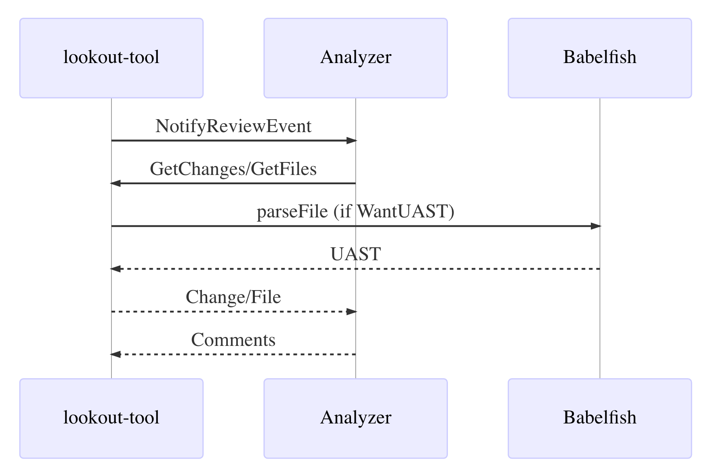

# lookout-tool Binary

_For the **lookout-sdk** library to develop new analyzers go to [**lookout-sdk**](https://github.com/src-d/lookout-sdk) repository._

`lookout-tool` binary is a simplified version of the `lookoutd` server that works with a local git repository and does not need access to Github.

You can think about `lookout-tool` as a _curl-like_ tool to call an analyzer gRPC endpoint with a `ReviewEvent` or a `PushEvent`, from a local git repository, and send it to an analyzer without accessing GitHub at all. For convenience, `lookout-tool` also exposes a **source{d} Lookout DataService** backed by the same git repository.

You can download the latest `lookout-tool` from the [src-d/lookout releases page](https://github.com/src-d/lookout/releases).

This is the sequence diagram of the `ReviewEvent` made by `lookout-tool review`. You can compare it with a regular **source{d} Lookout** installation at the [Architecture documentation](architecture.md).



You can [edit this image](https://mermaidjs.github.io/mermaid-live-editor/#/edit/eyJjb2RlIjoic2VxdWVuY2VEaWFncmFtXG4gICAgcGFydGljaXBhbnQgc2RrIGFzIGxvb2tvdXQtc2RrXG4gICAgcGFydGljaXBhbnQgQW5hbHl6ZXJcbiAgICBwYXJ0aWNpcGFudCBCYWJlbGZpc2hcbiAgICBzZGstPj5BbmFseXplcjogTm90aWZ5UmV2aWV3RXZlbnRcbiAgICBBbmFseXplci0-PnNkazogR2V0Q2hhbmdlcy9HZXRGaWxlc1xuICAgIHNkay0-PkJhYmVsZmlzaDogcGFyc2VGaWxlIChpZiBXYW50VUFTVClcbiAgICBCYWJlbGZpc2gtLT4-c2RrOiBVQVNUXG4gICAgc2RrLS0-PkFuYWx5emVyOiBDaGFuZ2UvRmlsZVxuICAgIEFuYWx5emVyLS0-PnNkazogQ29tbWVudHNcbiIsIm1lcm1haWQiOnsidGhlbWUiOiJkZWZhdWx0In19) using [mermaid](https://mermaidjs.github.io). ([sourcecode](assets/lookout-tool-seq-diagram.md))

## Requirements

You will need to run an analyzer to be called by `lookout-tool`. You can run one of our [example analyzers](analyzers-examples.md), any of the already [available analyzers](../README.md#available-analyzers) or the one that you're developing.

If your analyzer makes use of UAST, you will also need a [Babelfish server](https://doc.bblf.sh/using-babelfish/getting-started.html) running.
To start it using [Docker Compose](https://docs.docker.com/compose/) clone this repository, or download [`docker-compose.yml`](../docker-compose.yml), and run:

```shell
$ docker-compose up bblfshd
```

This will create the [bblfshd](https://github.com/bblfsh/bblfshd) container listening on `localhost:9432`.


## Usage

To perform a `NotifyReviewEvent` call to an analyzer and serve the **source{d} Lookout DataService** endpoint, run:
```shell
$ lookout-tool review
```

To perform a `NotifyPushEvent` call to an analyzer and serve the **source{d} Lookout DataService** endpoint, run:
```shell
$ lookout-tool push
```

In the next section, you will find a more detailed example considering the most usual options for running `lookout-tool` against any analyzer from two given revisions.


## How Does It Work

If we look at this example history of a given local repository stored at `/somewhere/repo/path`:

```shell
$ git log --pretty=oneline --graph

*   d036524c463227524f4bbd7b207fb87bb8b89ee3 (HEAD -> master) Merge pull request #3
|\  
| * 045a24828327ac35a28186f9b9b437adc3f7b7a3 (branch-b) message
| * 804cbd94869cb173494ce1de410f2b48674bc772 message
|/  
*   9294ddb13cc7c8acd2db480c9e5c1396cd85e50a Merge pull request #2
|\  
| * 355f001d719bd0368c0469acd1a46298a80bacc0 (branch-a) message
| * 7f2ee64cd0a5891900cc368ae35e60a61c262060 message
|/  
*   fa97fa19e5c9b3482e5f88e264fb62b1e7fc6d8f Merge pull request #1
*
*
...
```

If your current directory is this repository's path, and your analyzer is listening on the default port `9930`, you can run:
```shell
$ lookout-tool review
```

Doing so, `lookout-tool` will:

1. start a gRPC **source{d} Lookout DataService** endpoint backed by the repository stored at your current directory.
1. send a gRPC `NotifyReviewEvent` call to your analyzer listening on `ipv4://localhost:9930`. The `ReviewEvent` argument will contain a `commit_revision` field made of:
    * `base` pointing to `HEAD^` (`9294ddb...`)
    * `head` pointing to `HEAD` (`d036524...`)
1. wait until the analyzer sends a response with the comments. The analyzer will be able to request file contents, file language or UASTs to the gRPC **source{d} Lookout DataService** endpoint exposed by `lookout-tool`
1. once the analyzer sends the response, `lookout-tool` will put it into the `STDOUT`, stop the **source{d} Lookout DataService** and exit.

Use the different options to trigger a different analysis. For example:

```shell
$ lookout-tool review \
  --git-dir=/somewhere/repo/path \
  --from=fa97fa19e5c9b3482e5f88e264fb62b1e7fc6d8f \
  --to=branch-a \
  "ipv4://localhost:9999"
```

_For more options to run `lookout-tool`, take a look into [**lookout-tool Command Options**](#options)_

- If analyzer gRPC address is omitted, it will be `ipv4://localhost:9930`.
- If `--git-dir` is omitted, the current dir will be used.
- If `--from` is omitted, it will be `HEAD^`.
- If `--to` is omitted, it will be `HEAD`.
- Both `--from` and `--to` can be any [git revision](https://git-scm.com/docs/gitrevisions#_specifying_revisions). For example a tag name, branch name or the full commit SHA-1.

Everything explained above for `lookout-tool review` calling `NotifyReviewEvent`, applies also to `NotifyPushEvent` when using `lookout-tool push`.


<a id=options></a>
# Appendix: `lookout-tool` Command Options

`lookout-tool` binary include some subcommands as described above, and they accept many different options; you can use:
- `lookout-tool -h`, to see all the available subcommands.
- `lookout-tool subcommand -h`, to see all the options for the given subcommand.

Here are some of the most relevant options for both `lookout-tool push` and `lookout-tool review`:

| Env var | Option | Description | Default |
| --- | --- | --- | --- |
| `LOOKOUT_BBLFSHD` | `--bblfshd=` | gRPC URL of the Bblfshd server | `ipv4://localhost:9432` |
| `GIT_DIR` | `--git-dir=` | path to the Git directory to analyze | `.` _(current dir)_ |
| | `--from=` | name of the base [git revision](https://git-scm.com/docs/gitrevisions#_specifying_revisions) for event | `HEAD^` |
| | `--to=` | name of the head [git revision](https://git-scm.com/docs/gitrevisions#_specifying_revisions) for event | `HEAD` |
| | `--config-json=` | arbitrary JSON configuration for request to an analyzer | |

## Logging Options

| Env var | Option | Description | Default |
| --- | --- | --- | --- |
| `LOG_LEVEL` | `--log-level=` | Logging level (`info`, `debug`, `warning` or `error`) | `info` |
| `LOG_FORMAT`| `--log-format=` | log format (`text` or `json`), defaults to `text` on a terminal and `json` otherwise | |
| `LOG_FIELDS` | `--log-fields=` | default fields for the logger, specified in json | |
| `LOG_FORCE_FORMAT` | `--log-force-format` | ignore if it is running on a terminal or not | |
