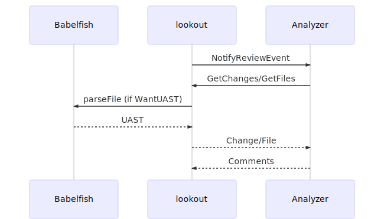

# Lookout Analyzer SDK

An analyzer is a [gRPC](https://grpc.io/) server that implements the [Analyzer service](https://github.com/src-d/lookout-sdk/blob/master/proto/lookout/sdk/service_analyzer.proto) to receive events from the lookout server.

At the same time, an analyzer acts as a gRPC client to access the [Data Server](https://github.com/src-d/lookout-sdk/blob/master/proto/service_data.proto) exposed by the lookout server. This endpoint will provide the necessary source code and [Babelfish Universal Abstract Syntax Trees (UAST)](https://doc.bblf.sh/uast/uast-specification.html). See `LOOKOUT_DATA_SERVER` environment variable below for more details.

If your analyzer needs to access the Babelfish API you can point your [Babelfish client](https://docs.sourced.tech/babelfish/using-babelfish/clients) to the same Data Server address (defined by `LOOKOUT_DATA_SERVER`). The lookout server will proxy these gRPC requests to Babelfish.

All the needed `.proto` files are located in the [/sdk directory](https://github.com/src-d/lookout-sdk/tree/master/proto).

## Code generation

gPRC communication is performed using protocol buffers. You can create a new analyzer in any language that supports protocol buffers, generating code from the `.proto` definitions. The resulting code will provide data access classes, with accessors for each field, as well as methods to serialize/parse the message structures to/from bytes.

Please refer to the [official Protocol Buffers documentation](https://developers.google.com/protocol-buffers/) to learn how to get started.

Pre-generated libraries code for Golang and Python is available in the [lookout-sdk repository](https://github.com/src-d/lookout-sdk).

## Developing an Analyzer

### Requirements

Before getting started you will need the latest `lookout-sdk` binary. It is a simplified version of the lookout server that works with local git repository and does not need access to Github. You can download it from the [releases page](https://github.com/src-d/lookout/releases).

If your analyzer makes use of UAST, you will need a [Babelfish server](https://doc.bblf.sh/using-babelfish/getting-started.html) running.
To start it using [Docker Compose](https://docs.docker.com/compose/) clone this repository, or download [`/docker-compose.yml`](/docker-compose.yml), and run:

```bash
$ docker-compose up
```

This will create the following Docker containers:

* [bblfshd](https://github.com/bblfsh/bblfshd), listening on `localhost:9432`
* [PostgreSQL](https://www.postgresql.org/), listening on `localhost:5432`, password `postgres`. _Note_: this will be a requirement for future functionality, it is not used right now.


### lookout SDK Commands

The `lookout-sdk` binary has the following sub-commands:
- `review`: Performs a `NotifyReviewEvent` call to the analyzer and serves the Data Server endpoint.
- `push`: Performs a `NotifyPushEvent` call to the analyzer and serves the Data Server endpoint.

Both `lookout-sdk push` and `lookout-sdk review` can be configured with environment variables or CLI arguments:

| Env var | Option | Description | Default |
| -- | -- | -- | -- |
| `LOG_LEVEL` | `--log-level=` | Logging level (`info`, `debug`, `warning` or `error`) | `info` |
| `LOG_FORMAT`| `--log-format=` | log format (`text` or `json`), defaults to `text` on a terminal and `json` otherwise | |
| `LOG_FIELDS` | `--log-fields=` | default fields for the logger, specified in json | |
| `LOG_FORCE_FORMAT` | `--log-force-format` | ignore if it is running on a terminal or not | |
| `LOOKOUT_DATA_SERVER`  | `--data-server=` | gRPC URL to bind the data server to | `ipv4://localhost:10301` |
| `LOOKOUT_BBLFSHD` | `--bblfshd=` | gRPC URL of the Bblfshd server | `ipv4://localhost:9432` |
| `GIT_DIR` | `--git-dir=` | path to the Git directory to analyze | `.` _(current dir)_ |
| | `--from=` | name of the base revision for event | `HEAD^` |
| | `--to=` | name of the head revision for event | `HEAD` |
| | `--config-json=` | arbitrary JSON configuration for request to an analyzer | |

### NotifyReviewEvent

The main output of the Analyzer will be the `NotifyReviewEvent` response comments, triggered by Pull Requests from GitHub. For development purposes you can manually trigger a review event for a Git repository in your local filesystem, using `lookout-sdk review`.

For example, if you place the `lookout-sdk` binary in a git repository directory, you can run:

```bash
$ ./lookout-sdk review ipv4://localhost:10302
```

In this case the `lookout-sdk` binary will send a gRPC `NotifyReviewEvent` call to your Analyzer, which should be listening on `ipv4://localhost:10302`. The analyzer will be able to request file contents and UAST to the gRPC Data Server endpoint, exposed by the `lookout-sdk` binary at `ipv4://localhost:10301`.

The lookout-sdk process will wait until the Analyzer sends a response with the comments, and exit right after that. This means the Data Server endpoint will also stop being available.



[_Diagram source at mermaidjs_](https://mermaidjs.github.io/mermaid-live-editor/#/edit/eyJjb2RlIjoic2VxdWVuY2VEaWFncmFtXG4gICAgcGFydGljaXBhbnQgQmFiZWxmaXNoXG4gICAgcGFydGljaXBhbnQgbG9va291dFxuICAgIHBhcnRpY2lwYW50IEFuYWx5emVyXG4gICAgbG9va291dC0-PkFuYWx5emVyOiBOb3RpZnlSZXZpZXdFdmVudFxuICAgIEFuYWx5emVyLT4-bG9va291dDogR2V0Q2hhbmdlcy9HZXRGaWxlc1xuICAgIGxvb2tvdXQtPj5CYWJlbGZpc2g6IHBhcnNlRmlsZSAoaWYgV2FudFVBU1QpXG4gICAgQmFiZWxmaXNoLS0-Pmxvb2tvdXQ6IFVBU1RcbiAgICBsb29rb3V0LS0-PkFuYWx5emVyOiBDaGFuZ2UvRmlsZVxuICAgIEFuYWx5emVyLS0-Pmxvb2tvdXQ6IENvbW1lbnRzXG4iLCJtZXJtYWlkIjp7InRoZW1lIjoiZGVmYXVsdCJ9fQ)


By default the `lookout-sdk review` command will trigger a review for the changes between `HEAD^` and `HEAD`. If we look at this example history:

```
$ git log --pretty=oneline --graph

*   d036524c463227524f4bbd7b207fb87bb8b89ee3 (HEAD -> master) Merge pull request #3
|\  
| * 045a24828327ac35a28186f9b9b437adc3f7b7a3 (branch-b) message
| * 804cbd94869cb173494ce1de410f2b48674bc772 message
|/  
*   9294ddb13cc7c8acd2db480c9e5c1396cd85e50a Merge pull request #2
|\  
| * 355f001d719bd0368c0469acd1a46298a80bacc0 (branch-a) message
| * 7f2ee64cd0a5891900cc368ae35e60a61c262060 message
|/  
*   fa97fa19e5c9b3482e5f88e264fb62b1e7fc6d8f Merge pull request #1
*
*
...
```

The `NotifyReviewEvent` call will contain a `ReviewEvent` argument with a `commit_revision` field made of:
- `base` pointing to `9294ddb...` (`HEAD^`)
- `head` pointing to `d036524...` (`HEAD`)

Use the `--from` (base) and `--to` (head) options to trigger the analysis between any other [git revisions](https://git-scm.com/docs/gitrevisions#_specifying_revisions).

For example, using commit sha1s:

```bash
$ ./lookout-sdk review \
--from=fa97fa19e5c9b3482e5f88e264fb62b1e7fc6d8f \
--to=355f001d719bd0368c0469acd1a46298a80bacc0 \
ipv4://localhost:10302
```

Let's say you have `branch-c` that is ahead of `master` by a few commits. Then you could run:

```bash
$ ./lookout-sdk review --from=master --to=branch-c ipv4://localhost:10302
```

### NotifyPushEvent

All the documentation for `NotifyReviewEvent` applies also to `NotifyPushEvent`, using `lookout-sdk push`.

_Important note_: The response for `NotifyPushEvent` allows a series of comments, but this is a placeholder for future functionality. The Analyzer is not expected to return any comment in current version.

This method call is used to notify the Analyzers of any new commits pushed to a repository. The Analyzer is not enforced to do anything with this notification. It could be used, for example, to re-train an internal model using the new contents of the master branch.

# License
Apache 2.0, see [LICENSE](LICENSE).
